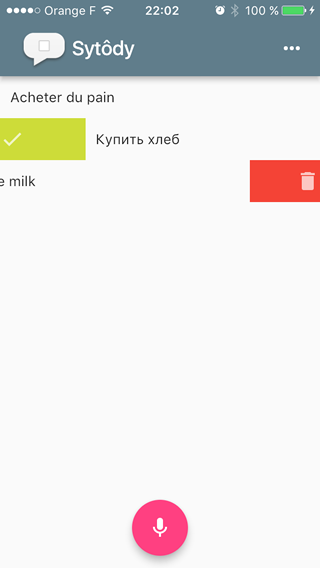

# Sytôdy, a Flutter "speech to text" todo app POC


:warning: iOS10(Swift) & Android

[](https://youtu.be/7MGuNZfgGWw)

## Usage

Install [flutter](http://flutter.io)

```bash
cd sytody
flutter run
```

:tv: [Video demo](https://youtu.be/7MGuNZfgGWw)

## How it works

**TL;DR** The flutter app open a channel on the host platform. It uses it :
 
 - to ask for speech recognition and microphone usage. The permission is asked on the first application launch 
 - to start, cancel and stop the speech recognition 
 - to listen to the recognition result
 
 **Flutter, native APIs and plugins**
 
- [1. Sytody](https://medium.com/@rxlabz/flutter-native-apis-and-plugins-1-3-3db651d79a7c)
- [2. Flutter channels](https://medium.com/@rxlabz/flutter-api-natives-et-plugins-2-3-27cbe7bb36ee)
- [3. Flutter plugins](https://hackernoon.com/flutter-native-apis-and-plugins-3-3-b84776fc8a7e)
 
### Recognition

- iOS : [Speech API](https://developer.apple.com/reference/speech) : 4 languages are enabled in Sytody : FR / EN / RU / IT
- Android : [SpeechRecognizer](https://developer.android.com/reference/android/speech/SpeechRecognizer.html) : recognition should work with the device default locale, but some others may needs to be installed to enable other languages.

### UI

#### Task list

A [ListView](https://docs.flutter.io/flutter/widgets/ListView-class.html) with [TaskWidget](https://github.com/rxlabz/sytody/blob/master/lib/task.dart) items

#### Dismissible

The tasks are displayed in a [Dismissible](https://docs.flutter.io/flutter/widgets/Dismissible-class.html) Widget

#### Languages menu

A [PopupMenuButton](https://docs.flutter.io/flutter/material/PopupMenuButton-class.html)  

## Getting Started with Flutter

For help getting started with Flutter, view our online
[documentation](http://flutter.io/).
